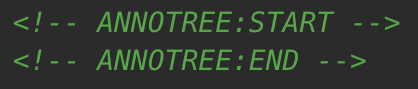

# Annotree - Automatic Annotated File Trees for Python 🌳

[](https://badge.fury.io/py/annotree)
[](https://pypi.org/project/annotree/)

**Annotree** is the easiest way to generate annotated project file trees in Python, automatically pulling descriptions from your Python-style docstrings and comments. Perfect for README files, documentation, and quick project overviews.

## 📋 Table of Contents

- [Installation](#-installation)
- [Usage](#-usage)
- [Pre-commit Integration](#-pre-commit-integration)
- [.treeignore](#-treeignore)
- [Example Output](#-example-output)

---

## ⚡ Key Features

- 🧠 **Automatic Annotations** – Pulls descriptions from first lines, comments, or `__init__.py` docstrings
- 📁 **Directory Descriptions** – Folders inherit descriptions from `__init__.py`
- 🚫 **Smart Ignore Support** – Honors `.treeignore` or `.gitignore` automatically
- 🎨 **Clean, Aligned Output** – Beautiful tree structure with readable annotations
- ⚙️ **Customizable** – Control depth, output format, and annotation alignment
- 🐍 **Python API & CLI** – Use as a library or from the command line
- 📎 **Pre-commit Hook Support** – Auto-update file trees in your README on every commit

---

## 💻 Installation

### Using uv (recommended)
```bash
uv pip install annotree
````

### Using pip

```bash
pip install annotree
```

### For Development

```bash
git clone https://github.com/yourusername/annotree.git
cd annotree
uv pip install -e .
```

---

## 🚀 Usage

### Command Line

```bash
# Generate tree in current directory
annotree

# Specify output file
annotree -o structure.txt

# Limit depth to 2 levels
annotree -l 2

# Show directories only
annotree -d

# Disable annotations for cleaner output
annotree --no-annotate

# Combine options: depth 3, no annotations, custom output
annotree -l 3 --no-annotate -o docs/structure.txt

# Embed tree into README between HTML comment tags
annotree --embed README.md -l 2 --no-annotate

# Use custom ignore file
annotree -i .customignore -o tree.txt

# Customize annotation alignment (default: 42)
annotree -a 60 -o tree.txt
```

### Python API

```python
from pathlib import Path
from annotree import tree, embed_tree_in_file

# Basic usage
tree(Path.cwd(), output_file="tree.txt")

# Custom options
tree(
    Path.cwd(),
    ignore_file=".treeignore",
    level=3,
    output_file="tree.txt",
    annotation_start=50,
    annotate=False  # Disable annotations
)

# Directories only
tree(Path.cwd(), limit_to_directories=True, output_file="dirs_only.txt")

# Embed into a file between tags
embed_tree_in_file(
    target_file=Path("README.md"),
    dir_path=Path.cwd(),
    level=2,
    annotate=False
)
```

---

## 📄 .treeignore

Create a `.treeignore` file in your project root to filter files specifically for Annotree (independent of `.gitignore`):

```
__pycache__/
*.pyc
.pytest_cache/
.venv/
node_modules/
dist/
build/
```

* If `.treeignore` exists, Annotree uses it automatically.
* Otherwise, `.gitignore` is respected if present.


---

## 📎 Pre-commit Integration

You can use Annotree as a pre-commit hook to automatically keep a file (for example `README.md`) in sync with your repository layout.

### Setup


1. **Add start/end tags** where you'd like the tree inserted in your `README.md`:

    

2. **Configure a pre-commit hook** in your `.pre-commit-config.yaml`:

   ```yaml
   repos:
     - repo: https://github.com/suecrumpler/annotree
       rev: main
       hooks:
         - id: annotree-readme
           name: Annotree README
           entry: annotree --embed README.md -l 2
           language: system
           pass_filenames: false
           files: '\\.(py|md)$'
   ```

3. **Install the hook**:

   ```bash
   pre-commit install
   ```

Now every time you commit, the file tree in your README will be automatically updated!

### Example: This Repository

This repository uses Annotree itself! The file structure below is auto-updated by the pre-commit hook:

<!-- ANNOTREE:START -->
```text

├─ annotree                               # annotree package - Generate annotated file trees with descriptions from file comments
│   ├─ __init__.py
│   ├─ __main__.py                        # Command-line interface for annotree
│   └─ annotree.py                        # Core tree generation logic
│
├─ tests                                  # Test suite for annotree package
│   ├─ __init__.py
│   └─ test_annotree.py                   # Unit tests for annotree core functionality
│
├─ .bumpversion.toml                      # Version bumping config
├─ .gitignore                             # .gitignore file for Python projects
├─ .pre-commit-config.yaml                # Pre-commit hooks configuration
├─ .treeignore                            # This file is used specifically for ignoring files for tree generation
├─ LICENSE                                # MIT License
├─ README.md                              # Annotree - Automatic Annotated File Trees for Python 🌳
├─ pyproject.toml                         # Project configuration for build, tools, and dependencies
└─ ruff.toml                              # Ruff configuration

2 directories, 13 files
```
<!-- ANNOTREE:END -->

---

## 📜 License

License MIT see [LICENSE](LICENSE) for details.

---

## 🤝 Contributing

Contributions welcome! Feel free to submit a Pull Request or open an Issue.

## 🔗 Links

* **PyPI**: [https://pypi.org/project/annotree/](https://pypi.org/project/annotree/)
* **GitHub**: [https://github.com/suecrumpler/annotree](https://github.com/suecrumpler/annotree)
* **Issues**: [https://github.com/suecrumpler/annotree/issues](https://github.com/suecrumpler/annotree/issues)
